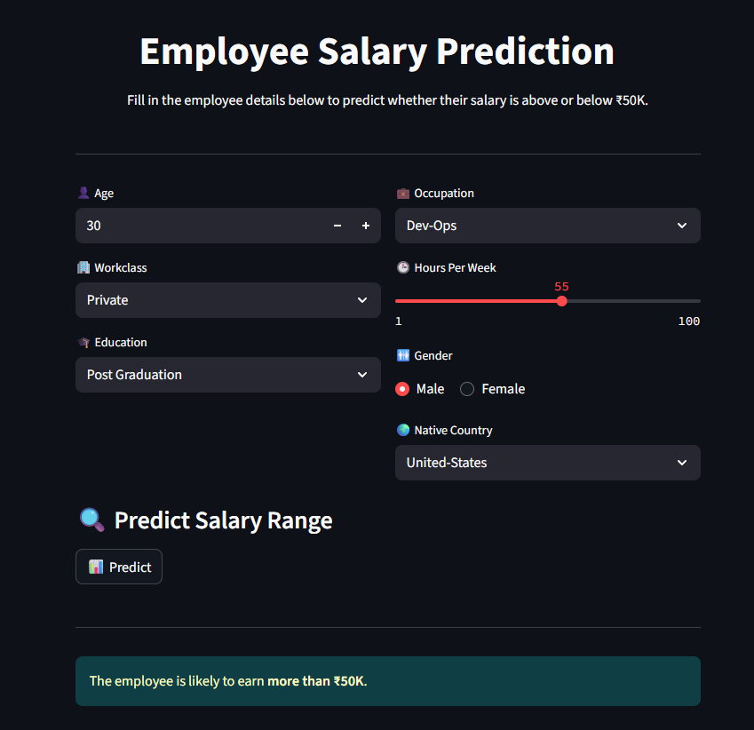
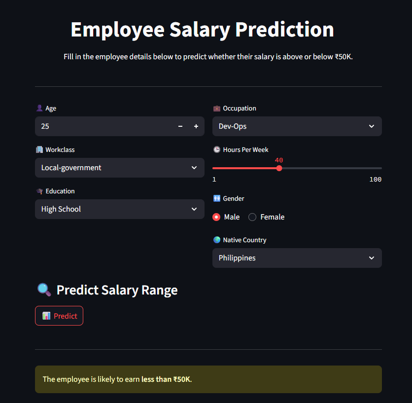

# Employee Salary Prediction
The Employee Salary Prediction App is a Streamlit-based interface that uses a trained machine learning classification model to predict whether an employee earns above or below ₹50K.

## Output-

---

## Project Files 

  - 'app.py' - Main Streamlit application script that takes user input, processes it, and displays the predicted salary category.
  - 'best_model.pkl' - The highest-performing model (based on metrics like accuracy) selected after evaluating multiple ML algorithms during training.
  - 'model_columns.pkl' - A list of feature column names used during model training.
  - 'adult 3.csv' - The cleaned version of dataset used for training and testing the salary prediction model.
  - 'employee salary prediction.ipynb' - Jupyter Notebook used preprocessing, training various models, performance comparison, and saving the final model files.

  ---
  
